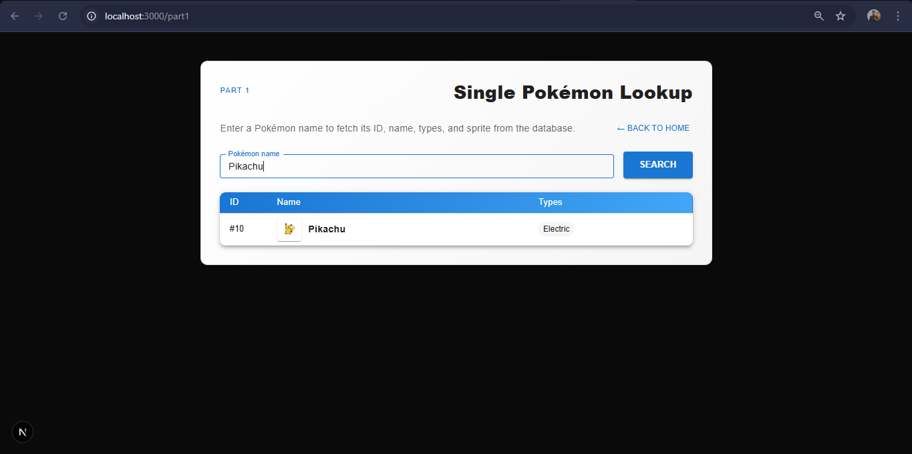
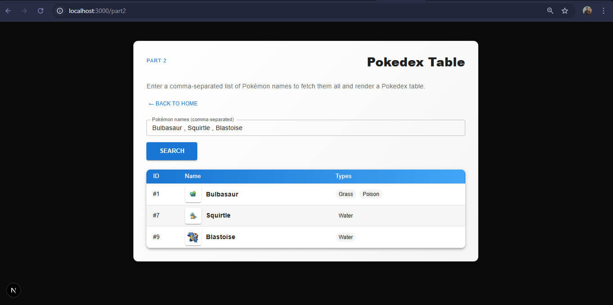
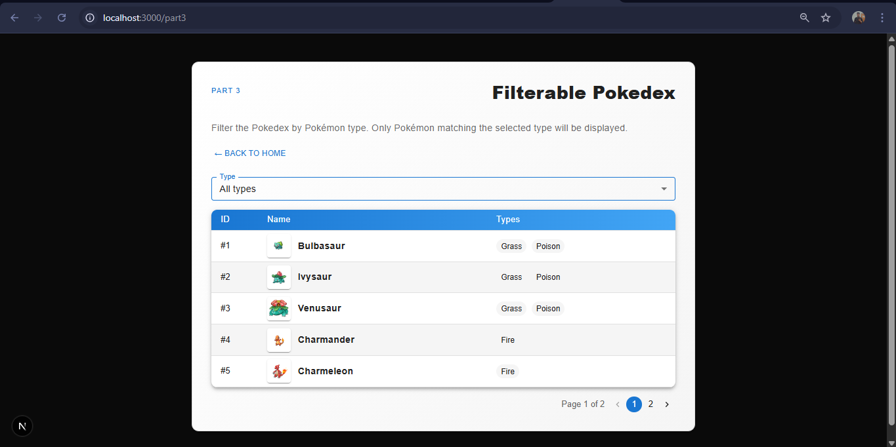

## Pokedex Assignment

Modern Pokedex-style web app built with **Next.js App Router (TypeScript)**, **tRPC**, **Prisma + PostgreSQL (Neon)**, **React Query**, and **Material UI**.  
The project is structured to be clean, modular, and easy to review for a technical assignment.

### Features

- **Part 1 – Single Pokémon lookup**  
  Form that accepts a Pokémon name (e.g. `Bulbasaur`) and renders a single row with **ID, name, types, and sprite** using a reusable `PokemonRow` component.

- **Part 2 – Pokedex table for an array of names**  
  Form that accepts a **comma‑separated list** of Pokémon names and displays them in a `PokedexTable` backed by a tRPC procedure returning an array of Pokémon.

- **Part 3 – Filterable, paginated Pokedex**  
  `FilterablePokedexTable` combines `PokemonTypeSelection` and `PokedexTable` to show only Pokémon matching the selected **type**, with simple pagination implemented on top of Prisma + tRPC.

- **Tech & quality**  
  - tRPC + React Query for **type‑safe data fetching & caching**  
  - Prisma + PostgreSQL for the **Pokemon database**, seeded with the first ~50 Kanto Pokémon  
  - Material UI for a **responsive, assignment‑ready UI** (desktop & mobile)

### Screenshots

Screenshots live in the `public/` folder so they render correctly on GitHub and Vercel:

- `public/pokedex-home.png` – Home page with navigation to all three parts  
- `public/pokedex-part1.png` – Part 1: single Pokémon lookup  
- `public/pokedex-part2.png` – Part 2: Pokedex table for multiple names  
- `public/pokedex-part3.png` – Part 3: type‑filterable, paginated Pokedex  

Rendered for quick review:






## Prerequisites

- **Node.js** 18 or higher  
- **PostgreSQL** database (e.g. Neon)  
- `DATABASE_URL` set in `.env` pointing to your Postgres instance

## Local setup

Install dependencies:

```bash
npm install
```

Run Prisma migrations and seed the database (creates the `Pokemon` table and inserts ~50 Pokémon):

```bash
npx prisma migrate dev
npm run prisma:seed
```

Start the development server:

```bash
npm run dev
```

Then open `http://localhost:3000` in your browser.

## Build & deploy

Create a production build locally:

```bash
npm run build
npm start
```

On **Vercel**:

- Configure `DATABASE_URL` in the project environment variables  
- Vercel will run `npm install`, `prisma generate` (via `postinstall`), and `npm run build` automatically  
- No extra custom build steps are required

