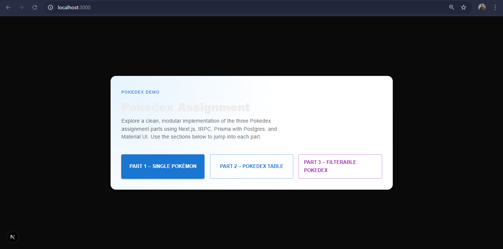

## Pokedex Assignment App

This project is a small Pokedex-style assignment built with **Next.js App Router**, **tRPC**, **Prisma + PostgreSQL**, **React Query**, and **Material UI**.  
It is designed to be simple, readable, and close to what you would submit for a technical assignment.

### Overview

- **Part 1** – Lookup a single Pokémon by name.
- **Part 2** – Render a Pokedex table for a comma‑separated list of names.
- **Part 3** – Filterable, paginated Pokedex by Pokémon type.

The UI uses Material UI components with a light, clean theme and is responsive for both mobile and desktop.

### Screenshot

The screenshot below shows the filterable Pokedex view used in Part 3:



## Prerequisites

- Node.js 18+  
- A PostgreSQL database  
- `DATABASE_URL` configured in `.env` (see `.env.example`).

## Local setup

Install dependencies:

```bash
npm install
```

Run Prisma migrations and seed the database:

```bash
npx prisma migrate dev
npm run prisma:seed
```

Start the development server:

```bash
npm run dev
```

Then open `http://localhost:3000` in your browser.

## Build & deploy

To create a production build locally:

```bash
npm run build
npm start
```

On Vercel:

- Set `DATABASE_URL` in the project’s environment variables.
- Vercel will run `npm install` and `npm run build` automatically.  
No additional build steps are required beyond Prisma’s default generate hook.
